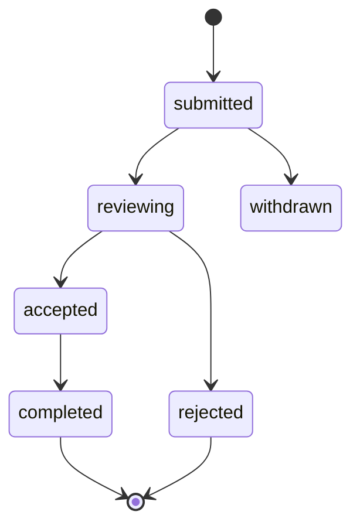

# Booking Request State Machine

## Entity

ENT-BookingRequest

## States

`submitted` → `reviewing` → `accepted` → `completed` | `rejected` | `withdrawn`

## Transitions

| From | To | Side effects |
|------|-----|--------------|
| submitted | reviewing | Auto; notify tenant office |
| reviewing | accepted | Create Lead or Enrollment per config |
| accepted | completed | Enrollment active |
| reviewing | rejected | Email contact |
| submitted | withdrawn | Public user cancel |

## Diagram

