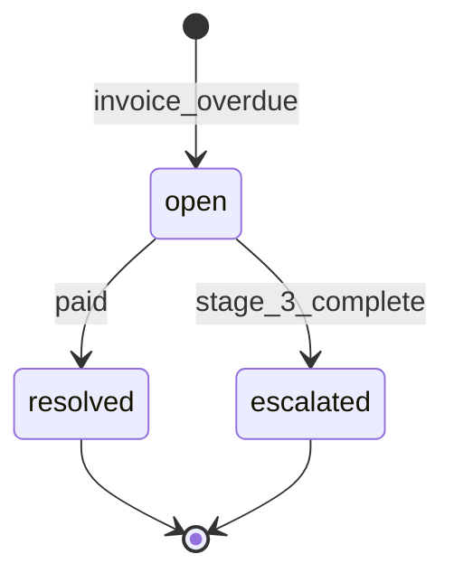

# Dunning State Machine

## Entity

ENT-DunningCase

## Stages

Stage 1 (reminder) → 2 (formal) → 3 (final) → `escalated` | `resolved`

## Transitions

| Stage | next_action_at | Action |
|-------|----------------|--------|
| 1 | due_date + 7d | Email template dunning_1 |
| 2 | +14d | Email dunning_2 |
| 3 | +21d | Email dunning_3; flag escalated |

Resolved when invoice paid or manually closed.

## Diagram

