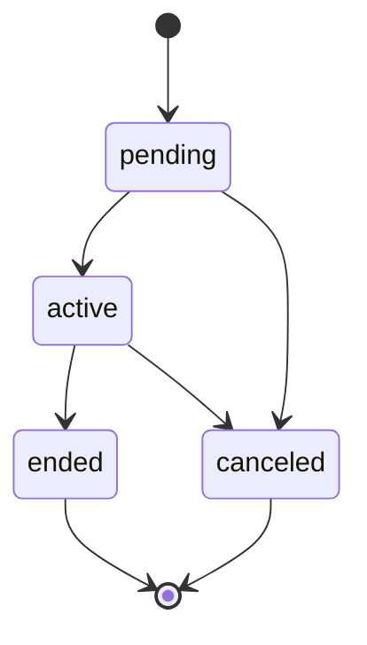

# Enrollment State Machine

## Entity

ENT-Enrollment

## States

`pending` → `active` → `ended` | `canceled`

## Transitions

| From | To | Guard | Side effects |
|------|-----|-------|--------------|
| pending | active | Capacity OK or waitlist promoted; consent OK for minors | Increment enrolled_count; EVT-EnrollmentCreated |
| pending | canceled | Staff/portal cancel | |
| active | ended | End date or staff action | Decrement count; EVT-EnrollmentEnded |
| active | canceled | Staff action | Decrement count |

## Diagram

