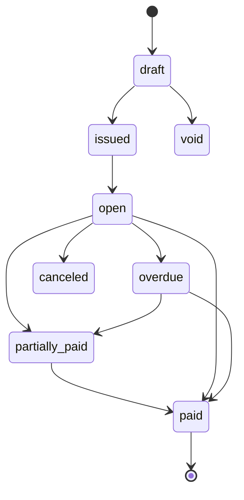

# Invoice State Machine

## Entity

ENT-Invoice

## States

`draft` → `issued` → `open` → `partially_paid` → `paid` | `overdue` | `canceled` | `void`

## Transitions

| From | To | Guard | Side effects |
|------|-----|-------|--------------|
| draft | issued | PROC-billing.issueInvoice | Assign number; PDF job; EVT-InvoiceIssued |
| issued | open | Immediately on issue | due_date set |
| open | partially_paid | Payment < gross | |
| partially_paid | paid | paid_cents >= gross | EVT-InvoicePaid |
| open | paid | Full payment | |
| open | overdue | due_date passed | Create DunningCase stage 1 |
| * | canceled | Admin; no payments | |
| draft | void | Discard | |

## Diagram

## Invariants

- No edit line items after issued
- overdue only from open (not draft)
