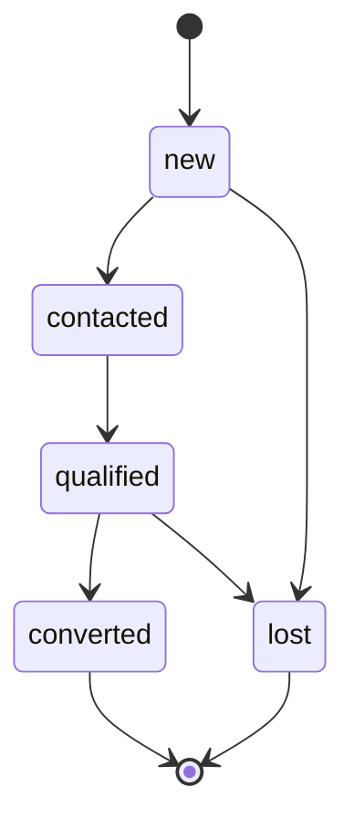

# Lead State Machine

## Entity

ENT-Lead

## States

`new` → `contacted` → `qualified` → `converted` | `lost`

Also: `new` → `lost` (direct)

## Transitions

| From | To | Guard | Side effects |
|------|-----|-------|--------------|
| new | contacted | Staff action | EVT-LeadUpdated, last_activity_at |
| contacted | qualified | Staff action | |
| qualified | converted | PROC-crm.convertLead success | Create Person/Customer/Member as selected; set converted_person_id; EVT-LeadConverted |
| * | lost | Staff sets reason | lost_reason required |
| lost | new | Admin reopen | Rare |

## Diagram

## Invariants

- converted is terminal; no edit except notes
- converted requires converted_person_id
