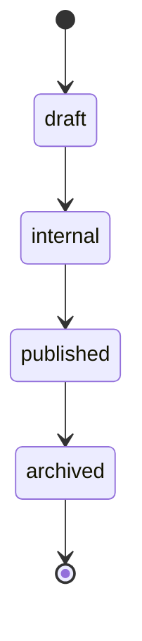

# Offer Publication State Machine

## Entity

ENT-Offer (+ PublicOfferProjection when marketplace)

## States (Offer.status)

`draft` → `internal` → `published` → `archived`

## Transitions

| From | To | Guard | Side effects |
|------|-----|-------|--------------|
| draft | internal | Required fields complete | |
| internal | published | Owner/admin; module marketplace optional | Upsert PublicOfferProjection; Meilisearch sync; EVT-OfferPublished |
| published | archived | No active enrollments OR force admin | Remove public projection |
| * | draft | Admin revert | Only if no issued invoices linked |

## Diagram

