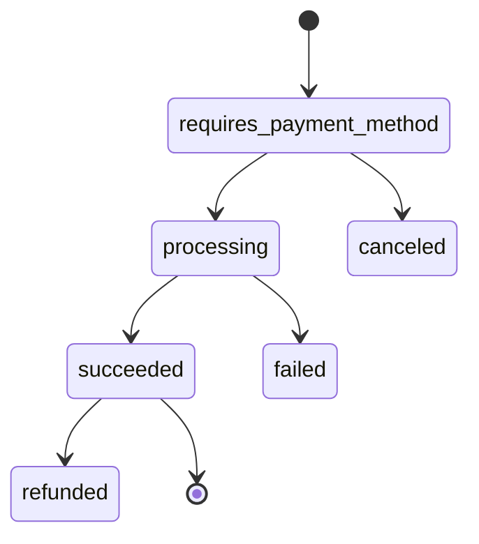

# Payment State Machine

## Entity

ENT-PaymentRecord (Stripe-aligned)

## States

`requires_payment_method` → `processing` → `succeeded` | `failed` | `canceled` | `refunded`

## MVP mock flow

| From | To | Action |
|------|-----|--------|
| requires_payment_method | succeeded | PROC-billing.recordMockPayment |
| requires_payment_method | failed | Mock decline |

## Side effects on succeeded

- Update invoice paid_cents
- Transition invoice state
- EVT-PaymentRecorded

## Diagram

