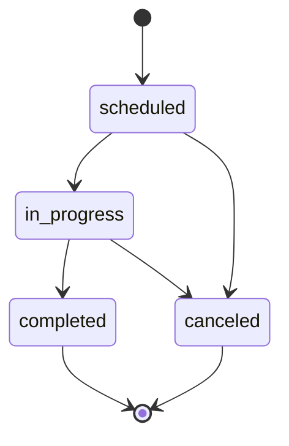

# Session State Machine

## Entity

ENT-Session

## States

`scheduled` → `in_progress` → `completed` | `canceled`

## Transitions

| From | To | Guard | Side effects |
|------|-----|-------|--------------|
| scheduled | in_progress | Auto at starts_at OR manual | |
| in_progress | completed | Auto at ends_at OR manual | Lock attendance optional config |
| scheduled | canceled | Staff; reason optional | Notify enrolled; EVT-SessionCanceled |
| in_progress | canceled | Admin only | |

## Diagram

