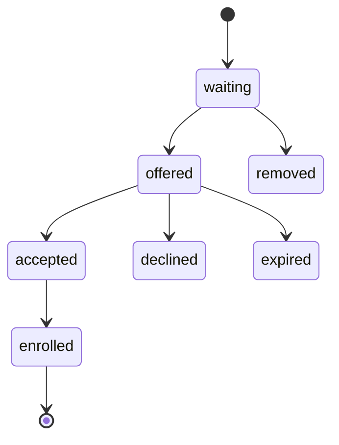

# Waitlist State Machine

## Entity

ENT-WaitlistEntry

## States

`waiting` → `offered` → `accepted` → `enrolled` | `declined` | `expired` | `removed`

## Transitions

| From | To | Guard | Side effects |
|------|-----|-------|--------------|
| waiting | offered | Promote when capacity | Email/portal notify; 48h expiry |
| offered | accepted | Portal/staff | Create enrollment pending→active |
| offered | declined | User action | Recompute positions |
| offered | expired | TTL | Next waiting promoted |
| waiting | removed | Staff | |

## Diagram

