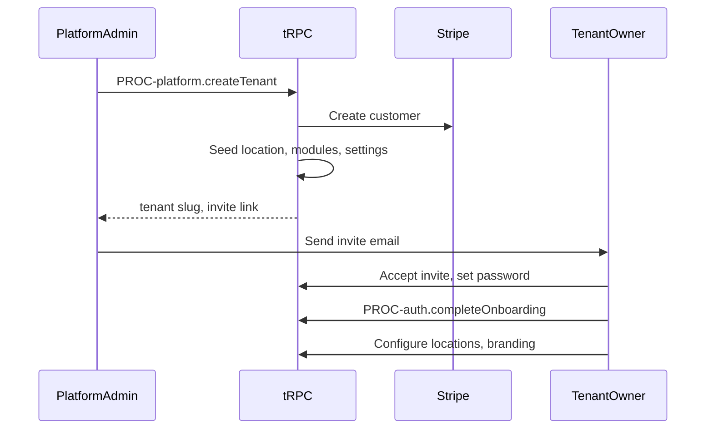

# Flow: Tenant Onboarding

## Purpose

Platform creates tenant; first owner accesses admin.

## Actors

platform_superadmin, tenant_owner

## Steps

## Procedures

`PROC-platform.createTenant`, `PROC-platform.createSubscription`, `PROC-auth.acceptInvite`

## Screens

`SCR-platform-tenant-create`, `SCR-admin-onboarding`

## AC reference

EPIC-001
