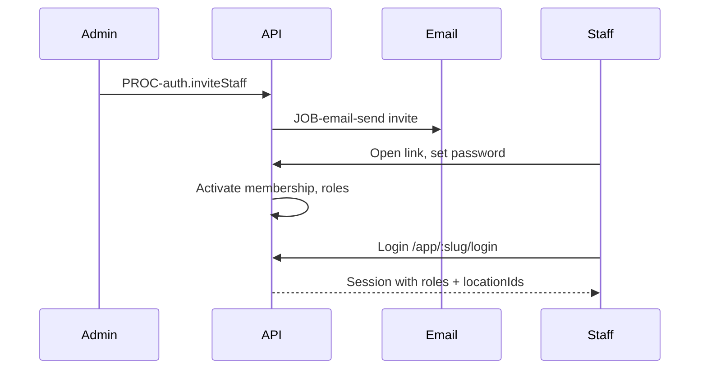

# Flow: Staff Invite and Login

## Purpose

Staff joins tenant with role and location scope.

## Steps

```mermaid
sequenceDiagram
  participant Admin
  participant API
  participant Email
  participant Staff

  Admin->>API: PROC-auth.inviteStaff
  API->>Email: JOB-email-send invite
  Staff->>API: Open link, set password
  API->>API: Activate membership, roles
  Staff->>API: Login /app/:slug/login
  API-->>Staff: Session with roles + locationIds
```

## Screens

`SCR-admin-settings-team`, `SCR-admin-login`

## AC

EPIC-002
