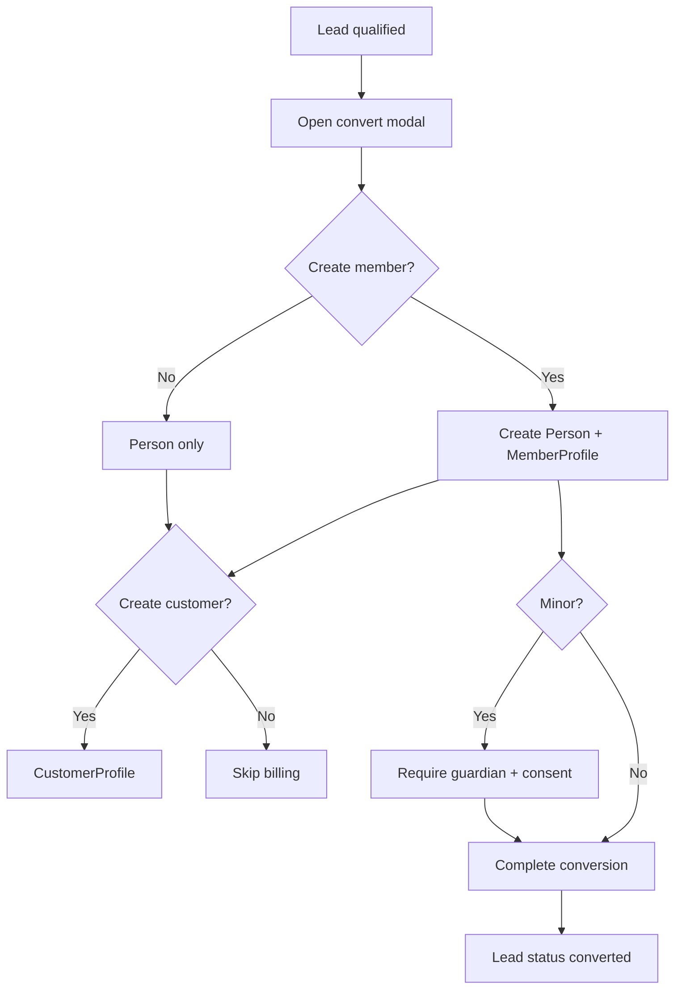

# Flow: Lead to Member Conversion

## Purpose

Convert qualified lead to person/customer/member.

## Steps

## Procedures

`PROC-crm.convertLead`

## Screens

`SCR-admin-lead-detail`, `SCR-admin-convert-lead-modal`

## AC

EPIC-010
