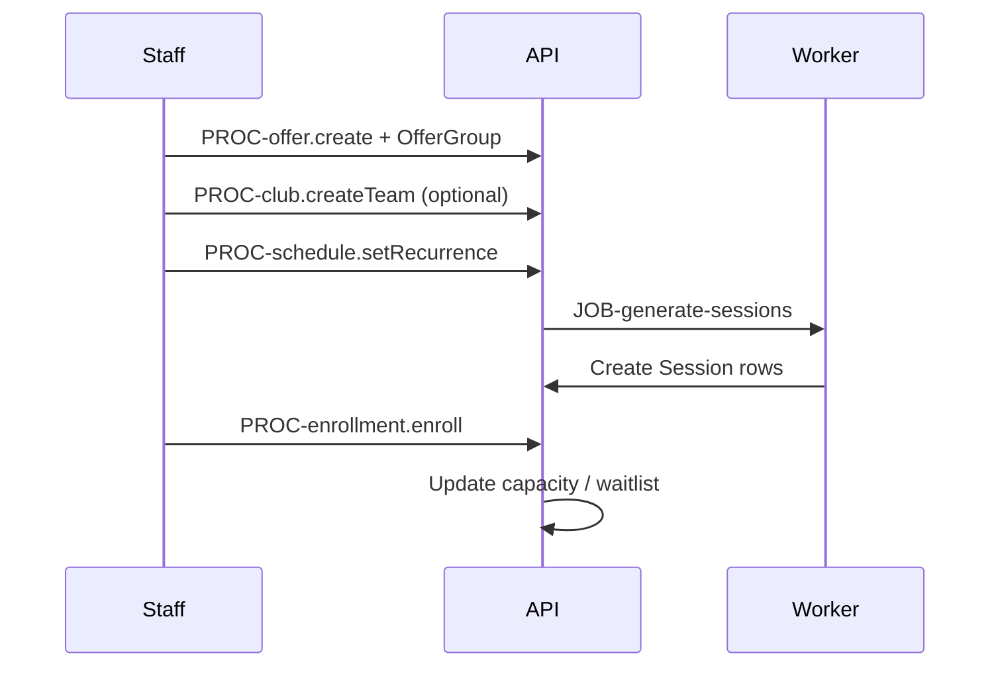

# Flow: Offer Create, Enroll, Schedule

## Purpose

End-to-end program setup.

## Steps

## Screens

`SCR-admin-offer-detail`, `SCR-admin-enroll-modal`, `SCR-admin-calendar`

## AC

EPIC-020, EPIC-021
