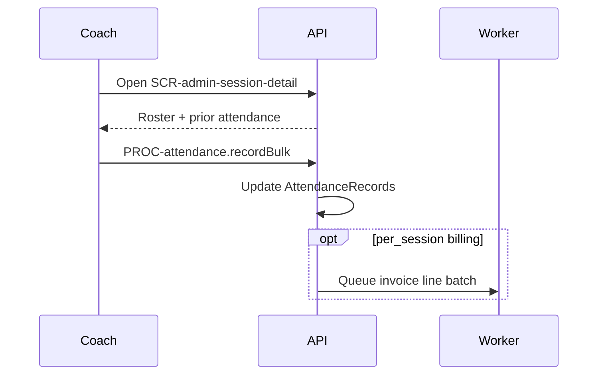

# Flow: Session Attendance (Club/Sport)

## Purpose

Coach records attendance for training session.

## Steps

```mermaid
sequenceDiagram
  participant Coach
  participant API

  Coach->>API: Open SCR-admin-session-detail
  API-->>Coach: Roster + prior attendance
  Coach->>API: PROC-attendance.recordBulk
  API->>API: Update AttendanceRecords
  opt per_session billing
    API->>Worker: Queue invoice line batch
  end
```

## Screens

`SCR-admin-session-detail`, `SCR-admin-roster`

## AC

EPIC-025
