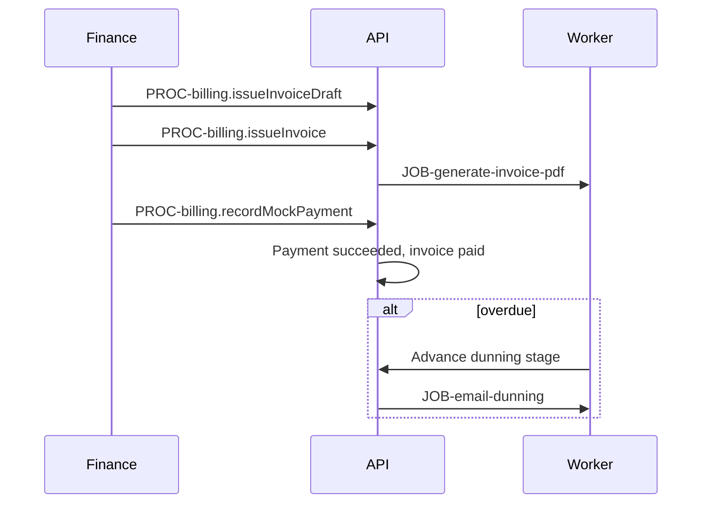

# Flow: Invoice Issue, Mock Payment, Dunning

## Purpose

Billing lifecycle MVP.

## Steps

```mermaid
sequenceDiagram
  participant Finance
  participant API
  participant Worker

  Finance->>API: PROC-billing.issueInvoiceDraft
  Finance->>API: PROC-billing.issueInvoice
  API->>Worker: JOB-generate-invoice-pdf
  Finance->>API: PROC-billing.recordMockPayment
  API->>API: Payment succeeded, invoice paid
  alt overdue
    Worker->>API: Advance dunning stage
    API->>Worker: JOB-email-dunning
  end
```

## Screens

`SCR-admin-invoice-detail`, `SCR-admin-billing-dashboard`

## AC

EPIC-030
