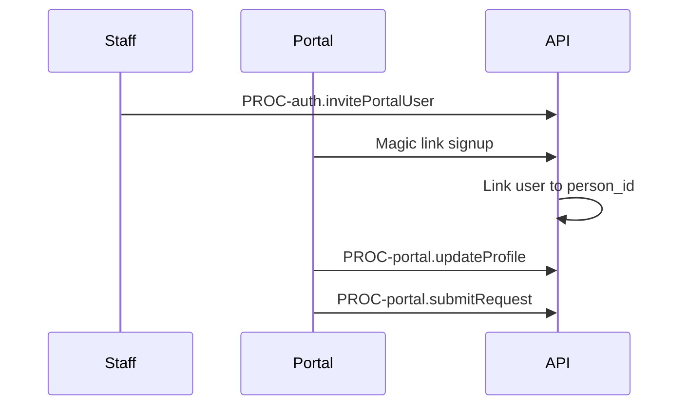

# Flow: Portal Invite and Self-Service

## Purpose

Portal user activation and profile edit.

## Steps

## Screens

`SCR-portal-invite`, `SCR-portal-profile`, `SCR-portal-requests`

## AC

EPIC-040
