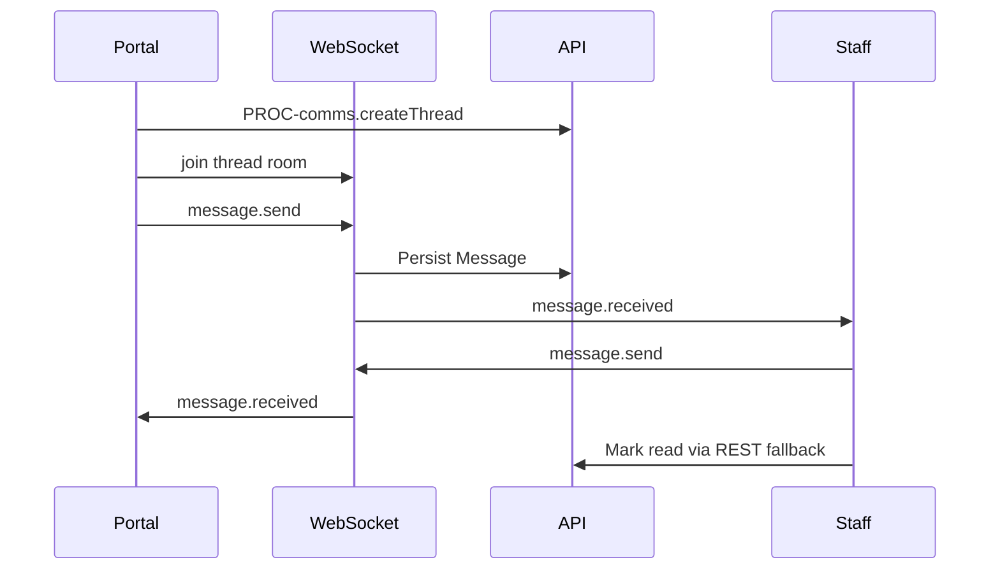

# Flow: Staff Portal Chat

## Purpose

Two-way WebSocket chat.

## Steps

## Protocol

[09-api-and-events/05-websocket-chat-protocol.md](../09-api-and-events/05-websocket-chat-protocol.md)

## Screens

`SCR-portal-messages`, `SCR-admin-inbox`

## AC

EPIC-041
