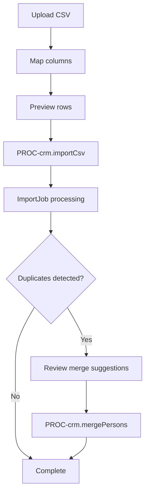

# Flow: Import and Duplicate Merge

## Purpose

CSV import and person merge.

## Steps

```mermaid
flowchart TD
  A[Upload CSV] --> B[Map columns]
  B --> C[Preview rows]
  C --> D[PROC-crm.importCsv]
  D --> E[ImportJob processing]
  E --> F{Duplicates detected?}
  F -->|Yes| G[Review merge suggestions]
  G --> H[PROC-crm.mergePersons]
  F -->|No| I[Complete]
  H --> I
```

## Screens

`SCR-admin-import`, `SCR-admin-merge-modal`

## AC

EPIC-011
