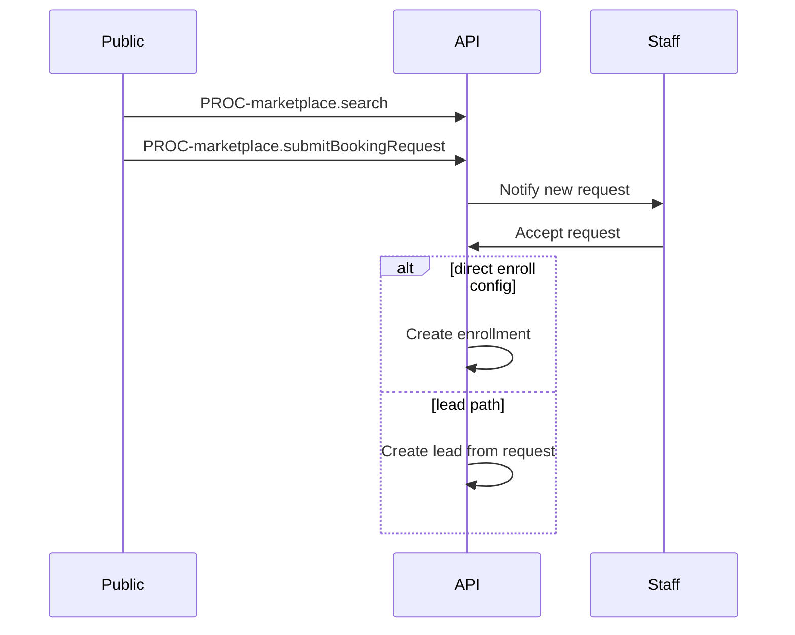

# Flow: Marketplace Discover to Enrollment

## Purpose

Public booking request to tenant pipeline.

## Steps

## Screens

`SCR-marketplace-search`, `SCR-marketplace-offer`, `SCR-admin-booking-requests`

## AC

EPIC-050 (post-MVP build, spec complete)
