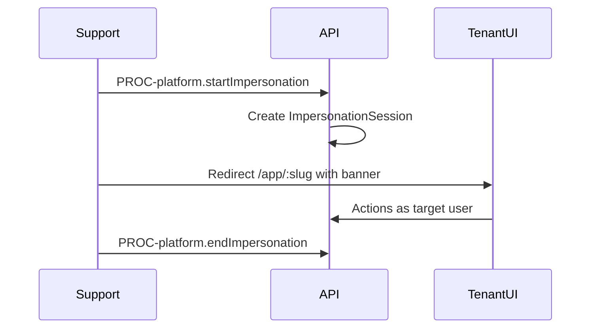

# Flow: Platform Impersonation Support

## Purpose

Support assists tenant user under audit.

## Steps

## Policy

[06-permissions/07-impersonation-policy.md](../06-permissions/07-impersonation-policy.md)

## Screens

`SCR-platform-tenant-detail`, impersonation banner all admin screens

## AC

EPIC-003
