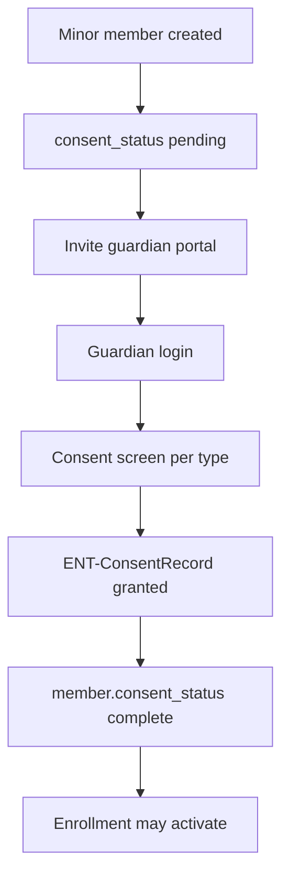

# Flow: Guardian Consent

## Purpose

Minor enrollment and portal consent.

## Steps

```mermaid
flowchart TD
  A[Minor member created] --> B[consent_status pending]
  B --> C[Invite guardian portal]
  C --> D[Guardian login]
  D --> E[Consent screen per type]
  E --> F[ENT-ConsentRecord granted]
  F --> G[member.consent_status complete]
  G --> H[Enrollment may activate]
```

## Screens

`SCR-portal-consent`, `SCR-admin-member-consent-status`

## AC

EPIC-012
