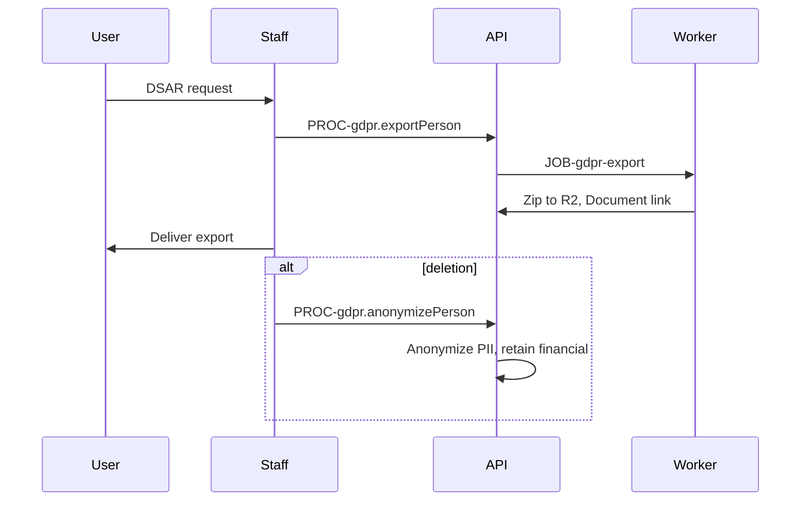

# Flow: Data Subject Export and Delete

## Purpose

GDPR DSAR handling.

## Steps

```mermaid
sequenceDiagram
  participant User
  participant Staff
  participant API
  participant Worker

  User->>Staff: DSAR request
  Staff->>API: PROC-gdpr.exportPerson
  API->>Worker: JOB-gdpr-export
  Worker->>API: Zip to R2, Document link
  Staff->>User: Deliver export
  alt deletion
    Staff->>API: PROC-gdpr.anonymizePerson
    API->>API: Anonymize PII, retain financial
  end
```

## Screens

`SCR-admin-person-privacy`, `SCR-portal-privacy`

## AC

EPIC-013
